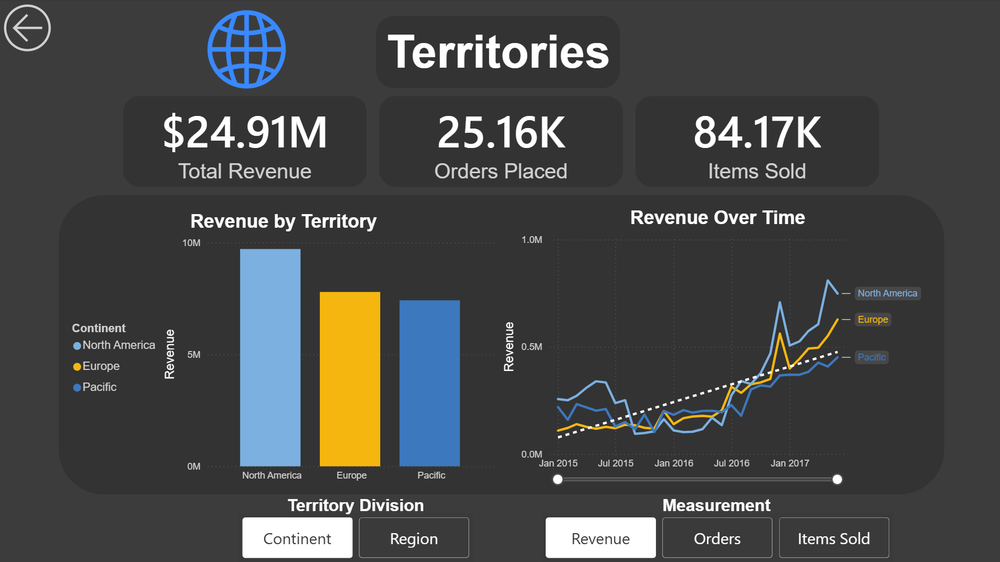
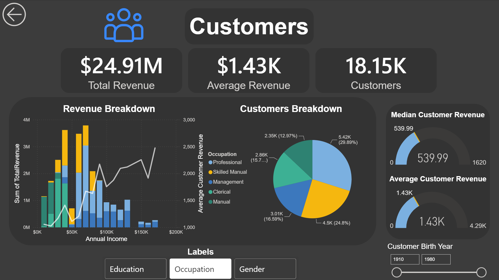
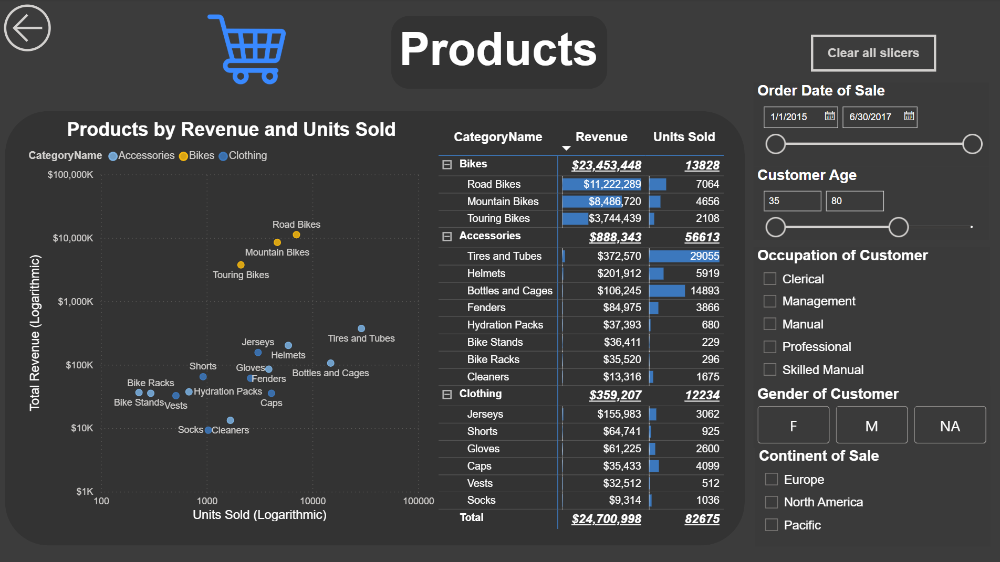
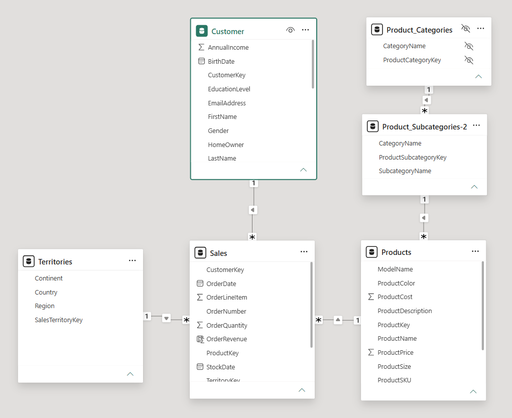
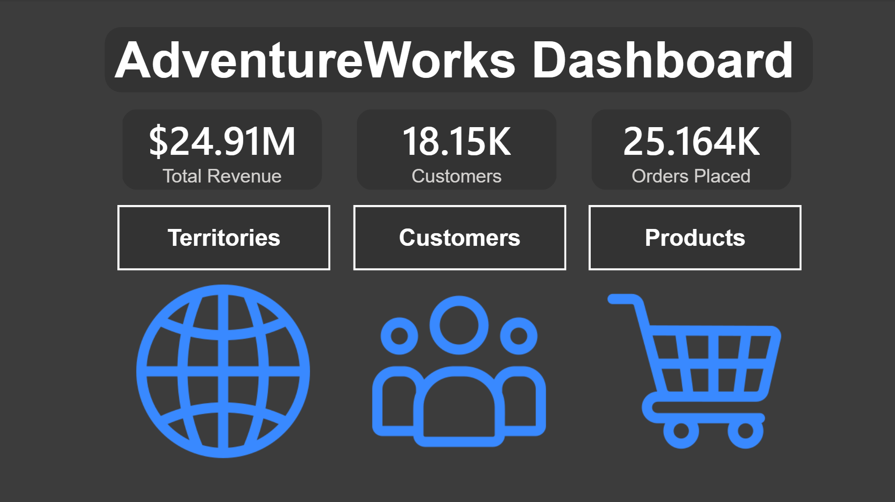
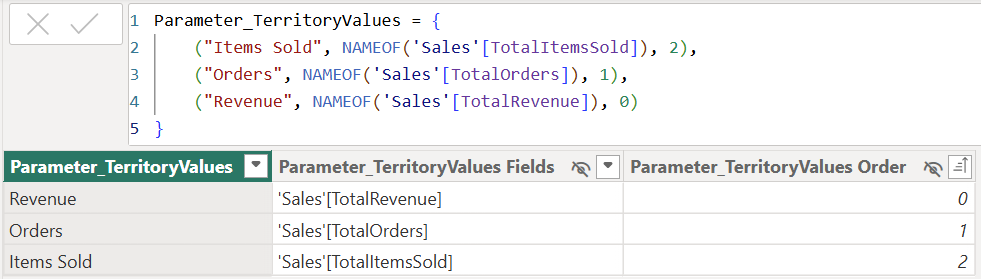
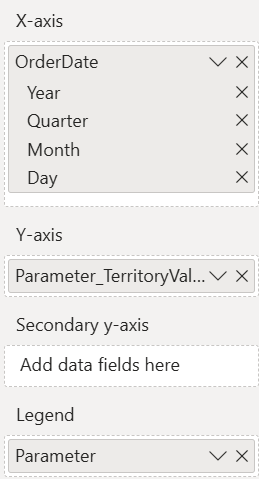
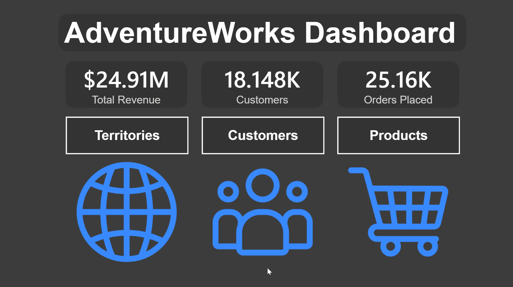
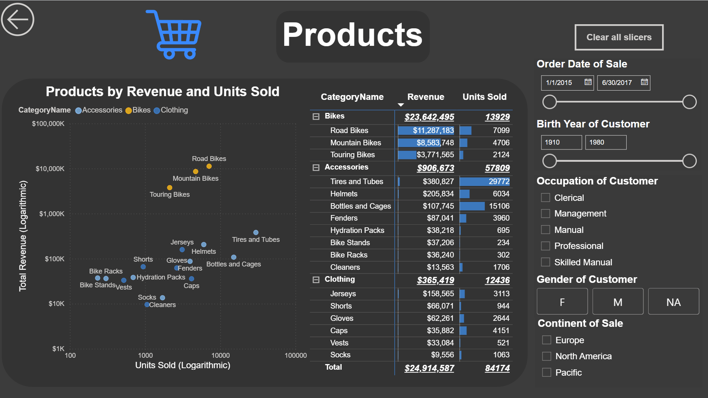

# Introduction

This is the fourth of four projects meant to showcase my knowledge of GitHub and various data science tools, such as Power BI. For this project, I worked with a relational database documenting customers, products, and sales for a store that sells bicycles and related accessories. Utilizing Power BI, I created an interactable dashboard for exploring the dataset and revenue by three major aspects: 

1. Territory
2. Customer demographics
3. Product category

Below you can see screenshots of the three dashboards. At the bottom of the README there is also a GIF of each, showcasing them being used.

<p align="center">
  
</p>

<p align="center">
  
</p>

<p align="center">
  
</p>

# Tools Used

- **Power BI**
    - Power Query: Used to load and transform the dataset.
    - DAX: Used to create measures to further analyze the data model.
    - Charts: Used to visualize the dataset and allow filtering via interacting with the charts.
    - Buttons: Used to allow navigation between pages and clearing of slicers.
    - Slicers: Used to allow user interaction in filtering the dataset.
    - Parameters: Used to allow the swapping of labels/axis measurements via slicers.
    
# Dataset

To make the Power BI file function on your computer, you may need to update the file paths for the dataset files. Follow these steps:

- Download the AdventureWorks_project.pbix file and all six csv/xlsx files from the dataset folder. Open the Power BI (.pbix) file.
- Open the Get transform data dropdown on the home ribbon and click Data Source Settings.
- Go through each of the six listed data sources and click the "Change Source" option in the bottom left, updating the source files to where they are locally stored on your computer (make sure you select the correct file).

<p align="center">
  
</p>

The dataset is sourced from a simplified version of the [AdventureWorks](https://dataedo.com/samples/html/AdventureWorks/doc/AdventureWorks_2/home.html) dataset found on [Kaggle](https://www.kaggle.com/datasets/sprasad018/adventureworks-dataset?resource=download).

The dataset, as visualized above, contains 5 tables. The most important table is the Sales table, which documents orders over the course of multiple years for the business. The other tables all store relevant data to those orders.

The Customer table stores data on customers with some demographic data such as birth date, education level, gender, and more.

The territories table stores data on the multiple territories of operations and some of their subdivisions. 

The Product table stores data on all the offered products with details such as price and category. The categories are assigned from the product's relationship with the Product_Subcategories and Product_Categories tables.

Once loaded, I cleaned the dataset with Power Query, removing unneeded columns and fixing the auto-assigned data types. For more in-depth usage, check out my Excel project, which used Power Query significantly more.


# Homepage
<p align="center">
  
</p>

For the dashboard there are 3 pages, focusing on the territories, customers, and products. To navigate between these pages, I created a homepage with navigation buttons. Each of the dashboards also includes a back button in the top left which navigates back to the homepage.

On the homepage and other pages are cards that highlight singular key takeaway values. In the above example the total revenue, count of unique customers, and total orders placed are highlighted. These were created utilizing a card visual. Some of these values are simple aggregations, such as the total orders placed, which is a distinct count aggregation on the OrderNumber (ID) in the sales table. The revenue calculations were more complex because I needed to calculate the revenue for each order, which requires using values from multiple tables. I created a calculated column in the sales table that calculated the revenue of an order with the following DAX code:
```
OrderRevenue = Sales[OrderQuantity] * RELATED(Products[ProductPrice]) 
``` 
With the calculated column, the rest was simple using a sum aggregation on said column. OrderRevenue is later used as the base for calculating other values such as the total revenue from a territory or a single customer. 

# Territories

<p align="center">
  
</p>

In addition to cards and charts, I used parameters to allow the user to customize the unit of an axis or the labels. In the territories dashboard, the user can swap between looking at continent values and region values. Additionally, they can swap between a y-axis measurement of revenue, orders, or items sold.

<p align="center">
  
</p>

Using the parameter section of the modeling tab, I created parameters for territory/region and revenue/orders/items. This creates a table, which can then be used in the axis section of building a visual.

<p align="center">
  
</p>

# Customers

<p align="center">
  
</p>

The process for building the visuals for the customer's page was similar to that of the territories page. The parameters created for this page were instead applied to the labels of the visual to help the user understand the breakdown of customer demographics.

The most notable difference is the addition of gauge charts, which I designed to help compare demographics to the overall median/average revenue. To achieve this, many of the values used to create the gauge are not dynamic, instead using `ALL()` in the DAX expression to prevent the value from changing because of filters. For example, if you were to select the gender label option and click on M or F on the pie chart, the target line and max do not change, but the fill value will, allowing you to compare the average/median revenue of customer genders to the overall average/median (see the gif at the bottom of the README for an example of the dashboard being used).

```
GuageMin = 0 

GuageMedian = CALCULATE(MEDIAN(Customer[TotalRevenue]),ALL())

GuageMedianMax = 3*[GuageMedian]
```
Above are the three DAX expressions that make up the minimum value, maximum value, and target value for the median gauge.

# Products

<p align="center">
  
</p>

For the products page I focused on the ability to visually compare the successes of the many offered subcategories of products. Since the products had a wide range of success in both revenue and sales numbers, I opted to create a logarithmic scatterplot, which plots both the revenue and sales of an item. I also added color coding based on the higher-level category (bike, accessory, or clothing) of the item. 

To help the user explore the successes of each category, I added many slicers to break down factors such as when the product was ordered, the age of the customer, and more. This is useful for focusing in on specific demographics, such as male manual workers in North America. It can also be useful for filtering the data to exclude outliers such as the customers who claimed to be over 100 years old (likely lied about their age) or filter the order date to only include orders after accessories and clothing started being sold (prior to July 2016, only mountain bikes and road bikes were sold).

I also included a clear slicers button, which, for the convenience of the user, will clear all slicer filters they have created.

# Conclusion

While not as useful as the Excel dashboards on the data jobs dataset, I still hope you found this dataset interesting. Creating this project was a great exercise in working with relational databases and creating a visually appealing way to interact with said database. Creating dashboards in Power BI is significantly more user-friendly than in Excel, which is why I tried to include much more variety in the types of charts and slicers offered.

# Showcase

<p align="center">
  
</p>

<p align="center">
  
</p>

<p align="center">
  
</p>